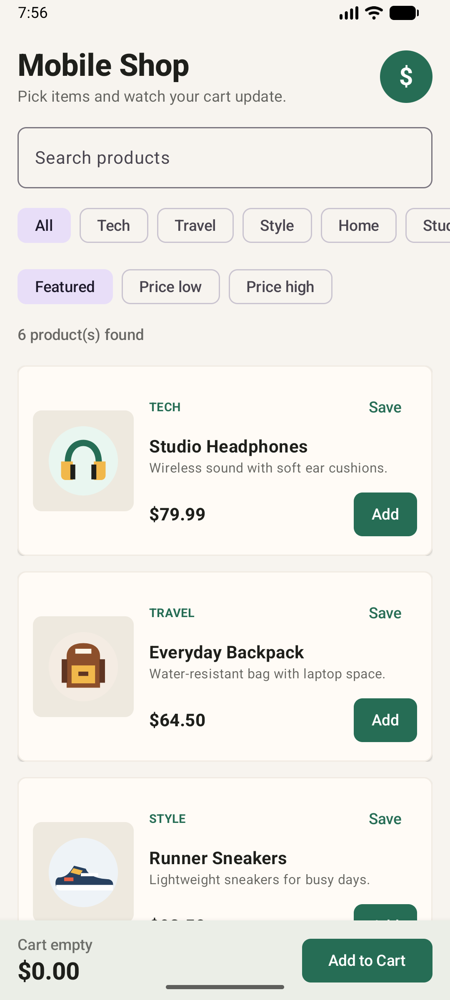
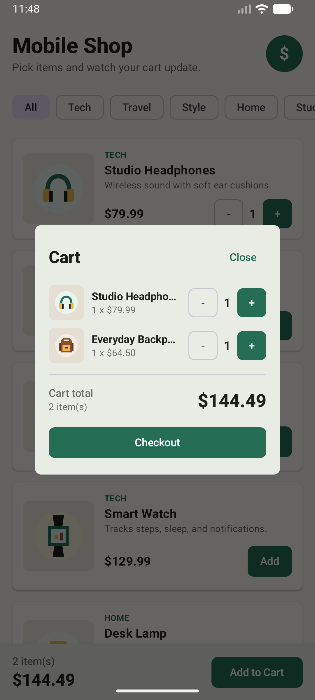
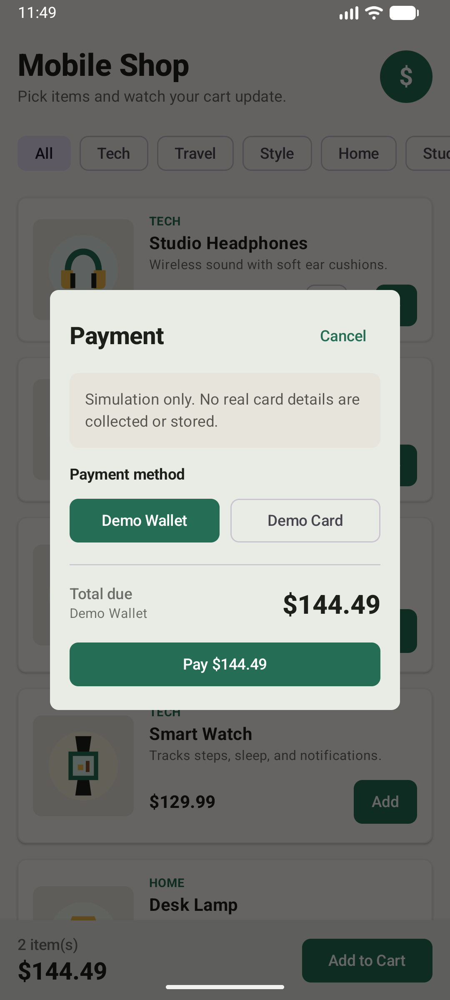

# Mobile Shop

Mobile Shop is a small Android shopping demo I built with Kotlin and Jetpack Compose. It has a product catalog, category filters, cart controls, and a demo checkout screen.

The payment part is only a simulation. The app does not ask for real card numbers, passwords, tokens, or personal payment details.

## Preview

| Product Catalog | Cart | Simulated Payment |
| --- | --- | --- |
|  |  |  |

## What The App Does

- Shows a simple product catalog with images, names, descriptions, and prices.
- Lets the user filter products by category.
- Lets the user add products to the cart and change quantities with `+` and `-`.
- Shows a cart total and item count.
- Opens the cart in a dialog on phone-sized screens.
- Shows the cart beside the catalog on wider screens.
- Includes a demo checkout flow with `Demo Wallet` and `Demo Card`.
- Clears the cart after the simulated payment is completed.

## Tech Used

- Kotlin
- Jetpack Compose
- Material 3
- Gradle Kotlin DSL
- JUnit tests

## Running The Project

You will need Android Studio, Android SDK Platform 36, and Java 21.

This project currently has a local Java path in `gradle.properties`:

```text
org.gradle.java.home=/opt/homebrew/opt/openjdk@21/libexec/openjdk.jdk/Contents/Home
```

If Java is installed somewhere else on your machine, update that path before syncing Gradle.

To build and run from the command line:

```bash
./gradlew test assembleDebug
adb install -r app/build/outputs/apk/debug/app-debug.apk
adb shell am start -n com.example.mobileshop/.MainActivity
```

The debug APK is created here:

```text
app/build/outputs/apk/debug/app-debug.apk
```

To make a release build:

```bash
./gradlew assembleRelease
```

The unsigned release APK is created here:

```text
app/build/outputs/apk/release/app-release-unsigned.apk
```

## Project Structure

```text
MobileShop/
|-- app/
|   |-- build.gradle.kts
|   |-- proguard-rules.pro
|   `-- src/
|       |-- main/
|       |   |-- AndroidManifest.xml
|       |   |-- java/com/example/mobileshop/
|       |   |   |-- MainActivity.kt
|       |   |   `-- ShopModels.kt
|       |   `-- res/
|       |       |-- drawable/
|       |       `-- values/
|       `-- test/java/com/example/mobileshop/
|           `-- ShopModelsTest.kt
|-- docs/screenshots/
|   |-- bag.png
|   |-- cart.png
|   |-- catalog.png
|   `-- payment.png
|-- gradle/wrapper/
|-- build.gradle.kts
|-- gradle.properties
|-- gradlew
|-- gradlew.bat
|-- README.md
`-- settings.gradle.kts
```

## Security Notes

This is a demo app, not a real payment app. I kept the checkout safe by not collecting any real payment information. The payment screen only lets the user choose between simulated options.

I also added a few basic Android hardening settings:

- App backup is disabled.
- Cleartext HTTP traffic is disabled.
- Release builds use minification.
- Release builds shrink unused resources.

The app does not use a backend, database, login system, network API, or real payment processor.

## Checks I Ran

```bash
./gradlew :app:assembleDebug
./gradlew :app:assembleRelease
```

Both builds passed.
